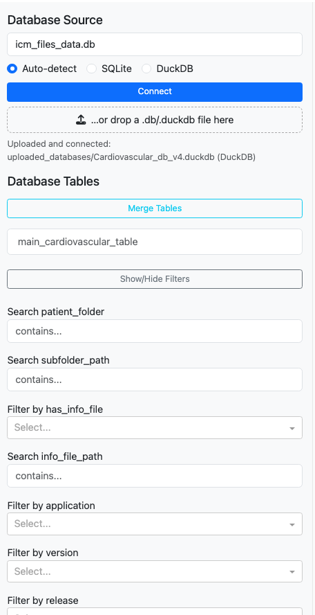
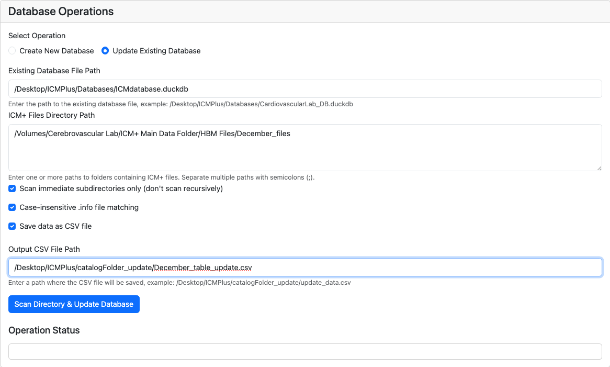

# ICM Cardiovascular App

A comprehensive Python package for creating and viewing ICM+ cardiovascular databases with interactive web interfaces.

## Features

- **Database Creator**: Scan ICM+ files and create searchable databases (SQLite or DuckDB)
- **Database Viewer**: Interactive web interface for exploring and analyzing cardiovascular data
- **Multiple Database Support**: Works with both SQLite and DuckDB formats
- **Filtering & Visualization**: Advanced filtering options and data visualization capabilities
- **Export Functionality**: Export filtered data to CSV format

## Screenshots

### Database Main Functionality


### Database Visualization


### Database Filters and Saving



### Database Creator Interface


### Database Update Operations



## Installation & Usage

You can use this package in different ways:

### Method 1: Simplest using Conda

1. **Create and activate a conda environment:**
   **If you do not have anaconda,you can dowload it here" https://www.anaconda.com/download**

   ```bash
   conda create -n icm-cardio python=3.9
   conda activate icm-cardio

   pip install git+https://github.com/elgraniti/ICM_Cardiovascular_app.git
   ```
2. **Use the command-line tools:**
   ```bash
   # Database Creator
   icm-database-creator
   
   # ICM Database Viewer
   icm-database-viewer
   ```

3. **OR Run the applications:**
   ```bash
   # Database Creator
   python database_creator.py
   
   # ICM Database Viewer
   python icm_cardiovascular/icm_database.py
   ```

## Application Features

### Database Creator (`database_creator.py` or `icm-database-creator`)

Launch at `http://localhost:8050` with features:
- Choose between SQLite and DuckDB formats
- Specify paths to ICM+ files
- Configure scanning options
- Create or update databases

### Database Viewer (`icm_database.py` or `icm-database-viewer`)

Launch at `http://localhost:8055` with features:
- Load SQLite or DuckDB databases
- Filter and search data
- Create visualizations
- Export filtered results
- Merge multiple tables

### Python API

You can also use the package programmatically:

```python
from icm_cardiovascular.database_creator import scan_icm_folders, create_database

# Scan ICM+ folders
df = scan_icm_folders("/path/to/icm/files")

# Create database
create_database(df, "my_database.duckdb", db_type="duckdb")
```

## Requirements

- Python 3.8+
- All dependencies will be automatically installed via pip

## Directory Structure

```
ICM_Cardiovascular_app/
├── icm_cardiovascular/
│   ├── __init__.py
│   ├── database_creator.py  # Database creation app
│   └── icm_database.py      # Database viewer app
├── setup.py
├── requirements.txt
├── README.md
└── MANIFEST.in
```

## Configuration

### Default Settings

- Database Creator runs on port 8050
- Database Viewer runs on port 8055
- Default database format is DuckDB

### Environment Variables

You can customize the behavior using environment variables:

```bash
export PORT=8080          # Change port
export DEBUG=False        # Disable debug mode
```

## Data Format

The applications work with ICM+ files that contain:
- Patient metadata in `.info` files
- Measures and modalities data
- Timestamp information
- Various clinical parameters

## Contributing

1. Fork the repository
2. Create a feature branch
3. Make your changes
4. Run tests: `pytest`
5. Submit a pull request

## License

This project is licensed under the MIT License - see the LICENSE file for details.

## Support

For issues and questions, please use the GitHub issue tracker:
https://github.com/elgraniti/ICM_Cardiovascular_app/issues

## Changelog

### Version 1.0.0
- Initial release
- Database creator with web interface
- Database viewer with filtering and visualization
- Support for SQLite and DuckDB formats
- Export functionality
- Console script entry points
